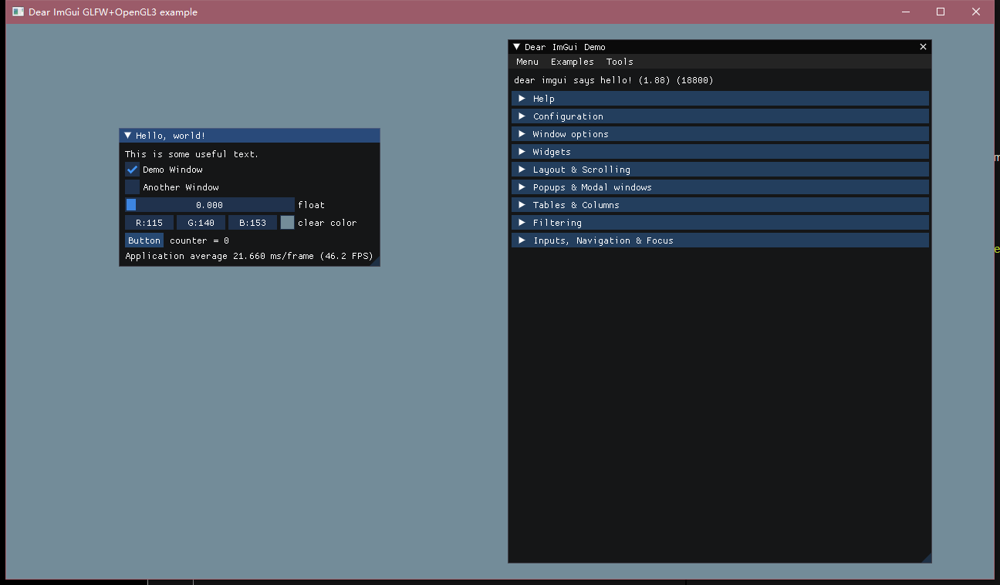

### 环境：
* Win10家庭版64位
* VS2019 
* 16.10 MSVC 14.29
* Clion

### 依赖安装：
#### glfw
1. 下载源码：https://www.glfw.org/download
2. 解压，管理员权限打开PowerShell，执行`mkdir build`和`cmake -S . -B build`
3. 管理员权限打开GLFW.sln
4. 生成*ALL_BUILD*；生成*INSTALL*

#### glew
1. 下载源码：https://sourceforge.net/projects/glew/files/latest/download
2. 解压，进入build/cmake，PowerShell执行`cmake .`
3. 管理员权限打开glew.sln
4. 依次生成*ALL_BUILD*和*INSTALL*
